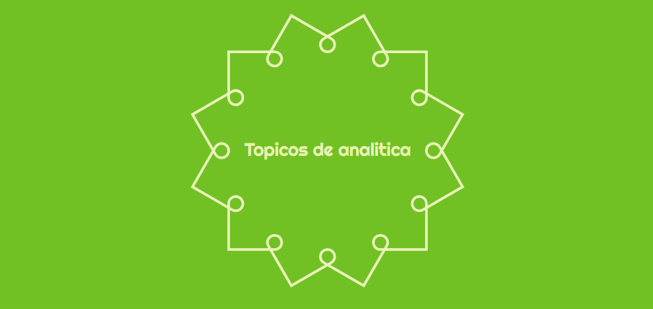

# Topicos Avanzados

>Este repositorio contiene la información desarrollada por el grupo de trabajo de la clase de Topicos Avanzados del segundo semestre del año 2024, clase de sábados de 7:00 am a 11:00 am.

Este repositorio esta dividido con la siguiente estructura que se encuentra en la tabla de contenido.

## Tabla de contenido

* [Talleres](#talleres) 

* [Requerimientos](#requerimientos)
  
* [Proyecto Final](#Proyecto_Final)

* [Arquitectura del Proyecto](#arquitectura_del_proyecto) 

* [Autores](#autores)

## Talleres
Aquí se almacenan los documentos de los talleres.
* [Talleres 1](https://github.com/daferocu/Topicos-Avanzados/tree/main/datalab/Talleres)
* [Talleres 2](https://github.com/daferocu/Topicos-Avanzados/tree/main/datalab/Talleres%202)
* [Talleres 3](https://github.com/daferocu/Topicos-Avanzados/tree/main/datalab/Talleres%203)
  
## Proyecto Final
Aqui se almacenan los documentos del proyecto final.
* [Proyecto 1](https://github.com/daferocu/Topicos-Avanzados/tree/main/datalab/Proyecto%201)
* [Proyecto 2](https://github.com/daferocu/Topicos-Avanzados/tree/main/datalab/Proyecto%202)
* [Proyecto 3](https://github.com/daferocu/Topicos-Avanzados/tree/main/datalab/Proyecto%203)

## Arquitectura del Proyecto
**Datalab**

* Proyecto 1: [Proyecto 1] Prección Frailejones
* Proyecto 2: [Proyecto 2] Predición Genero Película
* Proyecto 3: [Proyecto 3] Graphs
--------------------------------------------------------------------------------------
* Talleres 1: [Taller 1] Taller1_UsedVehiclePricePredictionDrift.ipynb
* Talleres 1: [Taller 2] Taller2_E1_UsedVehiclePricePredictionDeployment.ipynb
* Talleres 1: [Taller 3] E5-NeuralNetworksKeras.ipynb
* Talleres 1: [Taller 4] Taller_E4_Pretrained.ipynb
* Talleres 1: [Taller 5] SentimentPrediction.ipyn
--------------------------------------------------------------------------------------
* Talleres 2: [Taller 2] E1 - Sentiment Analysis
* Talleres 2: [Taller 2] E2 - Homework Analysis
* Talleres 2: [Taller 3] E3 - Song Embedding Visualization
* Talleres 2: [Taller 4] E4 - Spam Classification
* Talleres 2: [Taller 5] E5 - Neural Networks in Keras for NLP
* Talleres 2: [Taller 6] E6 - Neural Networks in PyTorch for NLP
* Talleres 2: [Taller 7] E7 - RNN, LSTM, GRU
* Talleres 2: [Taller 8] E8 - Text Summary
* Talleres 2: [Taller 9] E9 - Question Answering
* Talleres 2: [Taller 10] E10 - Open AI
--------------------------------------------------------------------------------------
* Talleres 3: [Taller 10] E10 - Twitter Analysis
* Talleres 3: [Taller 11] E11 - Patent Citation Network (Node2Vec with RecSys)

**Docs**

* [Proyecto Frailejones](https://github.com/daferocu/Topicos-Avanzados/tree/main/docs/Proyecto%201)
* [Proyecto Trama Películas](https://github.com/daferocu/Topicos-Avanzados/tree/main/docs/Proyecto%202)
* [Proyecto Grafos](https://github.com/daferocu/Topicos-Avanzados/tree/main/docs)

## Requerimientos

**Back-End:**

	•	Python (versión 3.9.7 o superior)

**Otros Requerimientos:**

	•	Git (versión 2.33.0 o superior): Para el control de versiones.
	•	GitHub: Repositorio para almacenamiento y colaboración en el código fuente.
	•	IDE recomendado: Visual Studio Code.

 | Organización  | Nombre del Miembro                     | Correo Electrónico            |
|---------------|----------------------------------------|-------------------------------|
| PUJ-Bogotá    | Diana Katherin Ibáñez  | ibanezc.d@javeriana.edu.co    |
| PUJ-Bogotá    | Daniel Felipe Rodríguez  | d.rodriguez@javeriana.edu.co |
| PUJ-Bogotá    | Paola Andrea Castro   | pa.castro@javeriana.edu.co    |
| PUJ-Bogotá    | Eduardo Correcha        | oe_correcha@javeriana.edu.co  |
| PUJ-Bogotá    | Erika Cárdenas     | cardenasre@javeriana.edu.co  |
