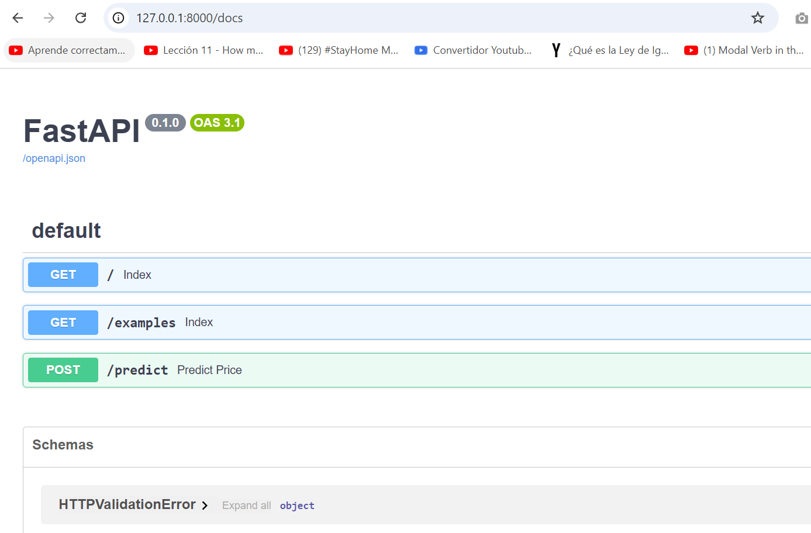
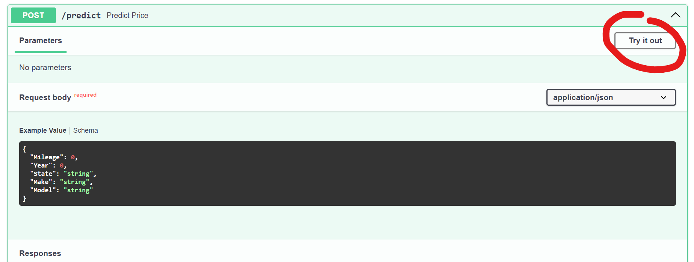
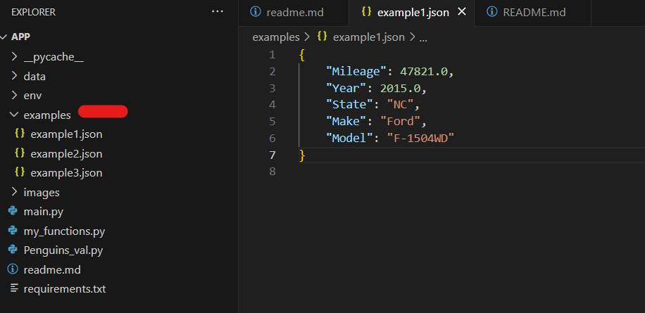

# Taller 2 

Class: Topicos avanzados de Analitíca <br>
Code: 10202 <br>
Professor: Sergio Alberto Mora Pardo <br>
Members:
- Diana Katherin Ibáñez 
- Daniel Felipe Rodríguez
- Paola Andrea Castro
- Oscar Correcha
- Erika Cárdenas

Carpeta api se encuentra la api correspondiente al taller. <br>
Carpeta resulados se encuentran los resultados de los modelos ajustados.<br>
Carpeta images se encuentran las imagenes que describen el proceso de ejecucion de la api.

Notas para ejecutar la Api en FastAPi

## Table of Contents

- <a href='#1'>1. Despliegue de API </a>
- <a href='#2'>2. Uso local de la API </a>
- <a href='#3'>3. Uso de ejemplos </a>

<hr>

### <a id='1'> Despliegue de API </a>

1. "Crear un entorno virtual de Python (compatible con Windows)

```bash
python -m venv env
```


2. Activar el entorno virtual

```bash
source env/Scripts/activate
```


3. Instalar los requisitos del sistema especificados en el archivo requirements.txt

```bash
pip install -r requirements.txt
python -m pip install --upgrade pip
```


4. Para ejecutar la API, utiliza el siguiente comando:

```bash
python -m uvicorn main:app --reload
```


A continuación, se procederá a abrir un navegador web e ingresar a la siguiente página:

```bash
http://127.0.0.1:8000/docs
```



### <a id='2'> Uso local de la API </a>

Al acceder a la API, se debe seleccionar el módulo 'predict'.


 Para activar las funciones de predicción, por favor, haga clic en el botón 'Try it out'.




### <a id='3'> Uso de ejemplos </a>

La carpeta 'examples' contiene ejemplos en formato JSON que pueden utilizarse como entrada para la API.



Se selecciona uno de los ejemplos, concretamente example1.json, y se introduce en el campo de la API siguiendo el mismo formato.


Se pone en marcha al hacer clic en 'Execute'.


En la parte inferior se presenta el resultado obtenido por el modelo en pantalla.


<hr>

[Go to Top](#Table-of-Contents)